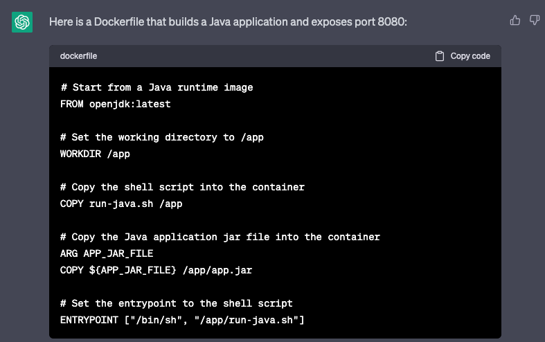
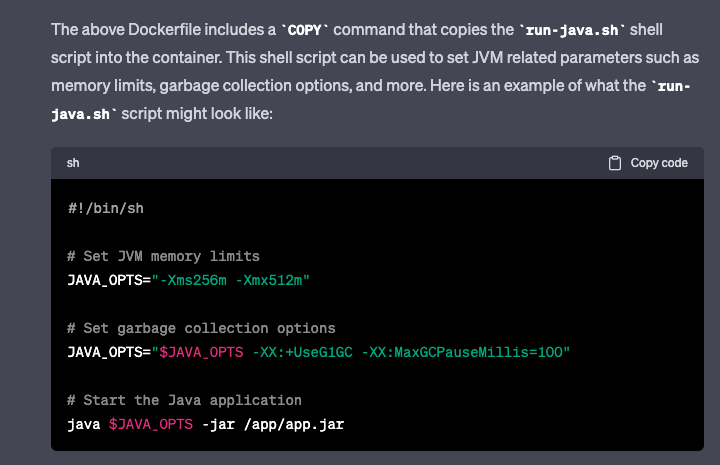
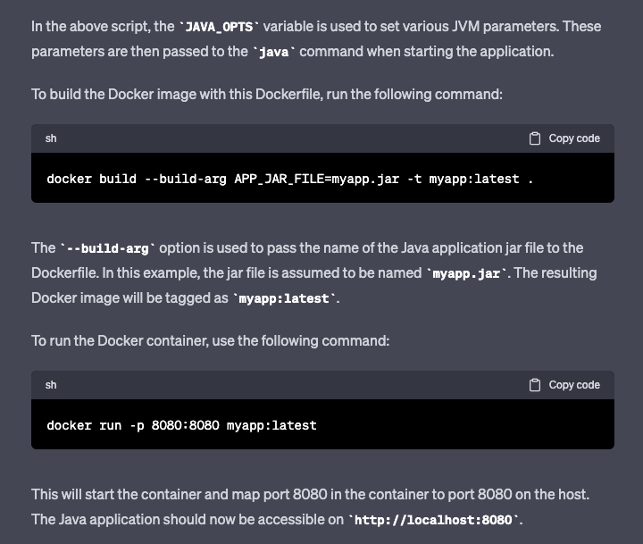

## 1. Create Dockerfile for Java app using ChatGPT
### Developer
```text
1. Write a Dockerfile for the java application and expose port 8080
2. In the dockerfile, the jar package name of the java application can be passed in during build
3. Write a shell script for running java applications, which can set jvm related parameters
4. Use the shell script of the second step in the docker file
   In summary, generate a complete dockerfile and shell script
```
### ChatGPT


