## 2. Create Kubernetes manifest file using ChatGPT
### Developer
```text
1. Create an executable and accessible kubernetes deployment manifest file for this docker image
```
### ChatGPT
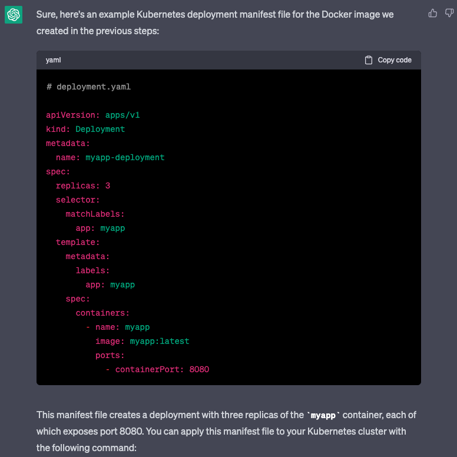
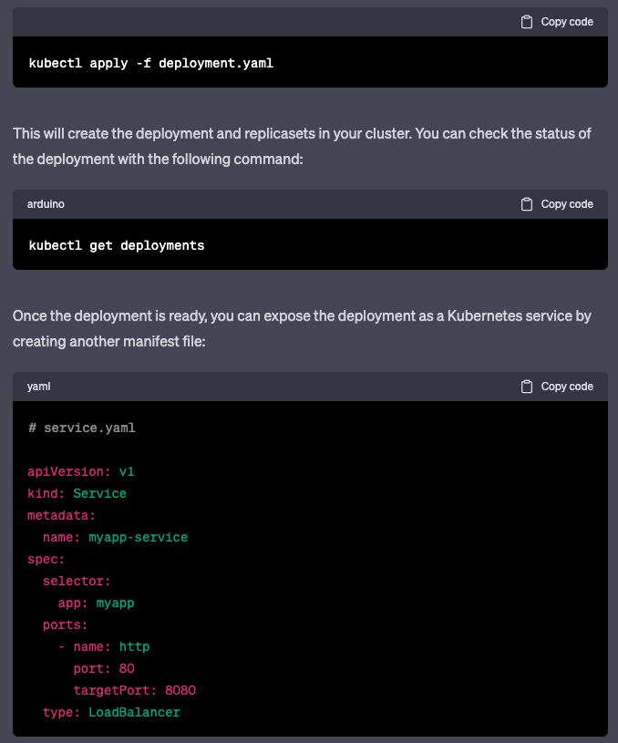
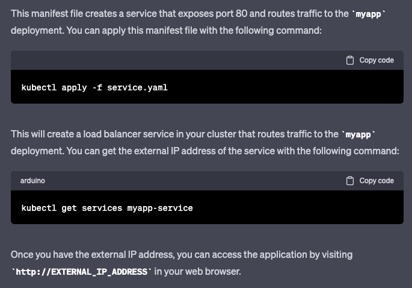

### Developer
```text
2. Please add namespace tag and enter it as parameter along with application name and image name, here please use simple implementation
```
### ChatGPT
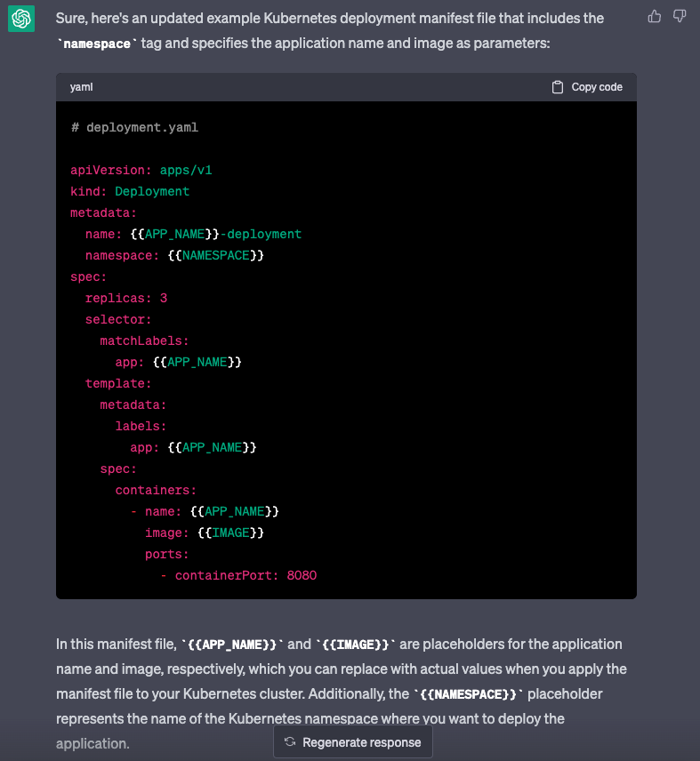
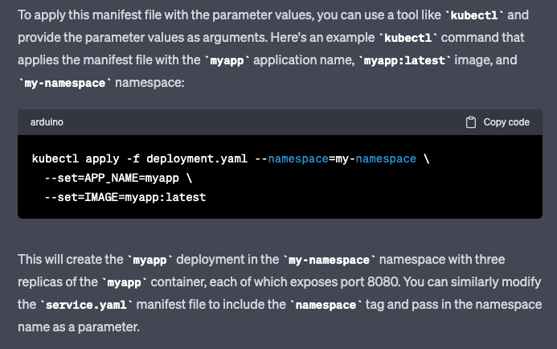

### Developer
```text
3. Add resource quotas to the deployment
```
### ChatGPT
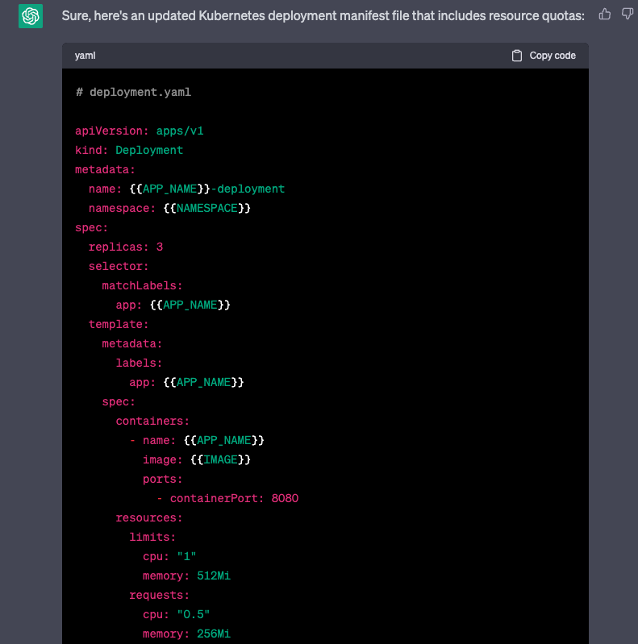
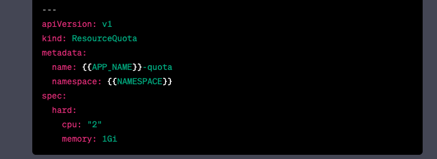
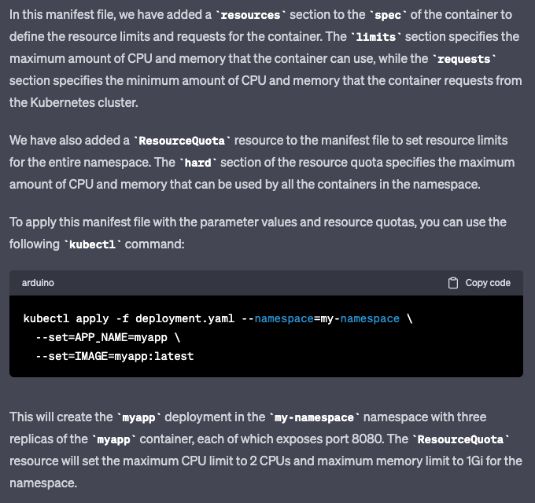

### Developer
```text
4. Adjust deployment manifest with production and security best practices
```
### ChatGPT
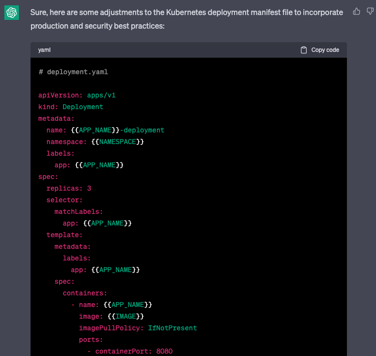
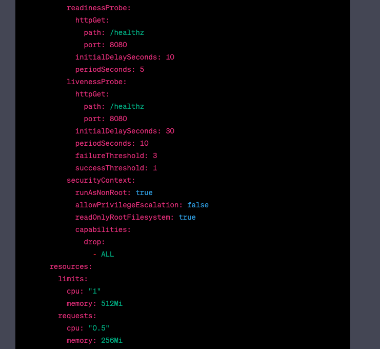
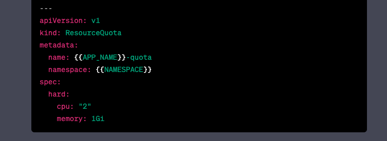
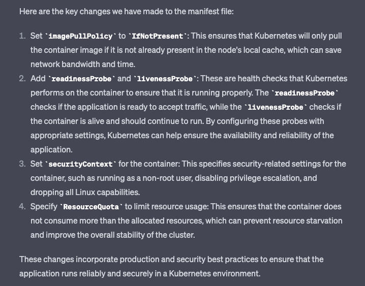
