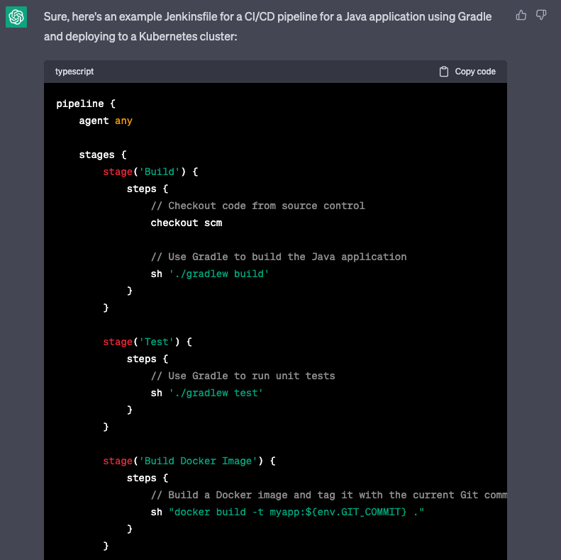
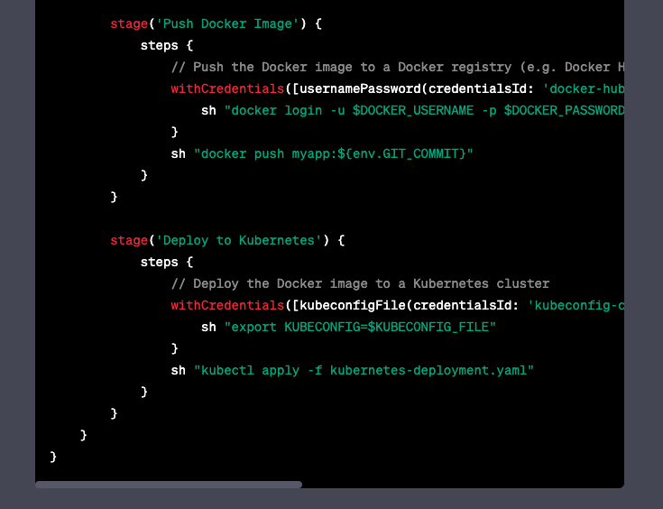
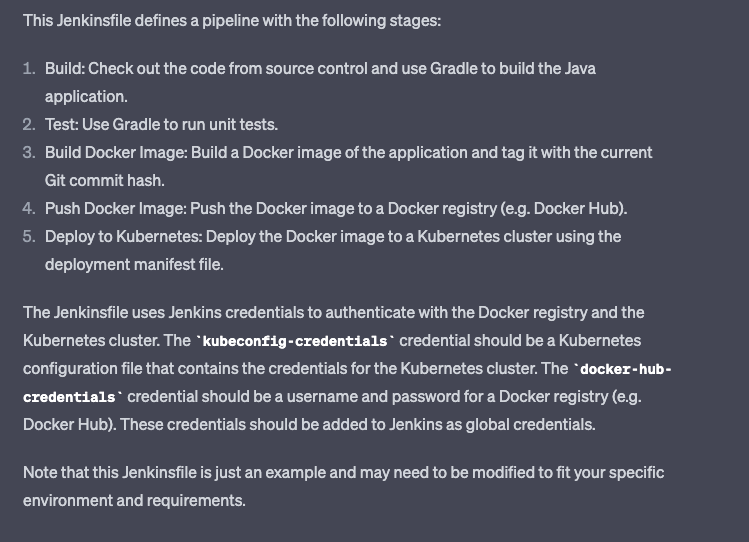
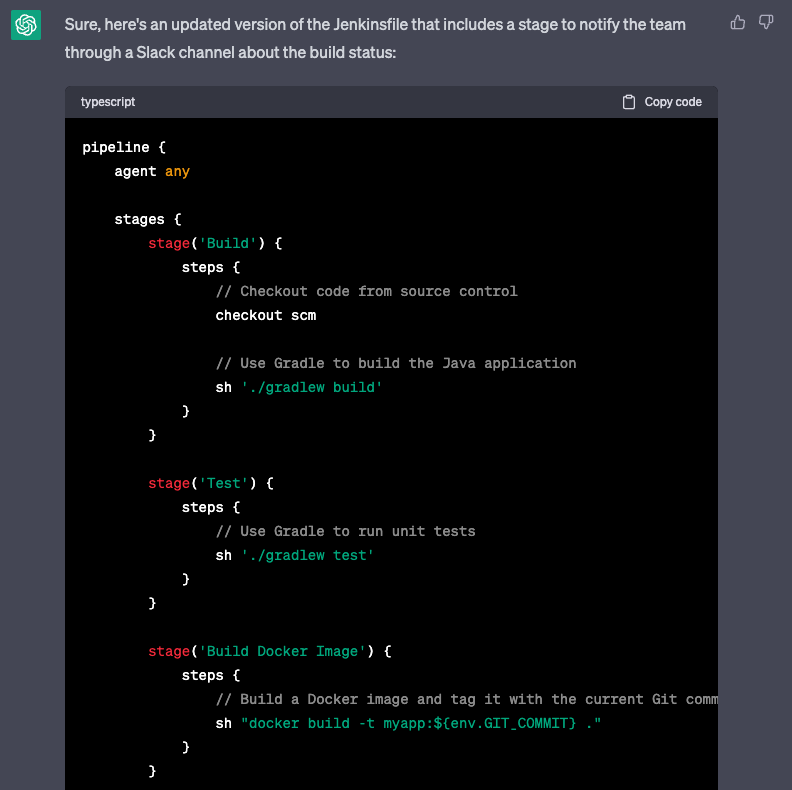
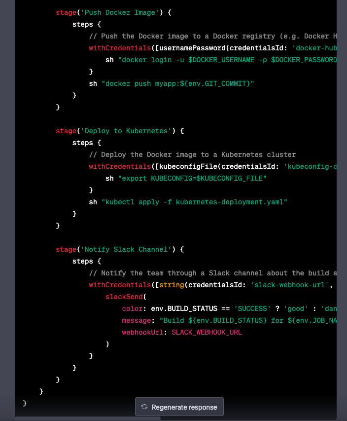
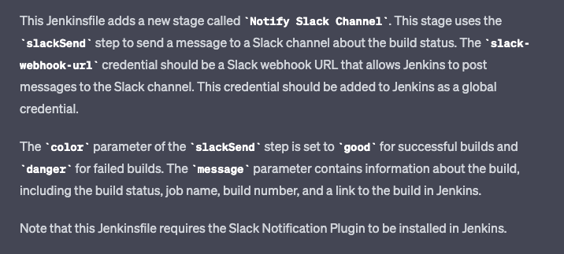

## 3. Create CI/CD pipeline code using ChatGPT
### Developer
```text
1. please write a Jenkinsfile for the complete CI/CD pipeline for the above java application, including deployment to k8s cluster, use gradle to build java applications
```
### ChatGPT




### Developer
```text
2. Add a stage to notify team through slack channel about the build status
```
### ChatGPT


